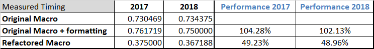

# An Analysis of Stock Data Using Excel

## Overview of Project
A VBA macro was created to enable financial analysis of stock performance.  This macro can be executed at the click of a button to analyze a desired year of data.
Because there could be a need to analyze a larger data set, this project was initiated to refactor and measure the performance of the macro.


# Results

## Performance of the Original Macro
The original financial analysis macro included a timer to enable performance measurement.  There were two datasets, one for 2017 and one for 2018.  The macro was used to analyze each dataset and the elapsed time was presented in a message box to the user.
Here is the result recorded for the 2017 dataset:


Here is the result recorded for the 2018 dataset:


## Augmentation of the Original Macro
Because the goal was to simplify the data analysis, the refactored macro also included conditional formatting of the financial data.  The original macro did not include this feature, so to ensure the comparison included all the desired functionality, the original macro was augmented with the reporting code and the timing measures were recorded.

Here is the result recorded for the 2017 dataset:


Here is the result recorded for the 2018 dataset:


## Refactoring the VBA Macro
The VBA macro was refactored to reduce the amount of rows processed per ticker symbol by creating three arrays to contain the data collected during the examination of the dataset rows, as seen in the following code snippet:   
```
    '1b) Create three output arrays
    Dim tickerVolumes(11) As Long
    Dim tickerStartingPrices(11) As Single
    Dim tickerEndingPrices(11) As Single
    
```

Additionally, a check was performed to determine if the current row contained the final entry for the current ticker symbol.  If this was the final data row for that ticker symbol, an `Exit Next` command was used to break out of the row processing and move on to the next ticker symbol.

Again, the macro was executed for both data sets and the timing measures were recorded.

Here is the result recorded for the 2017 dataset:


Here is the result recorded for the 2018 dataset:


## Analysis of VBA Macro Timing Measurements
The data collected during the execution of the macro runs was entered into Excel to compute the changes in performance and to visualize the results. This data is shown in the following table:



The Message Box results were used to compute the additional time that elapsed with the addition of the result formatting being added to the original macro.  We can see that these operations extended the original macro execution time by approximately 4.28% for the 2017 data set, and approximately 2.13% for the 2018 data set.

By examining the timing measures, we can see that the refactored macro performs significantly better.  The 2017 data set was processed in only 49.23% of the time that was required by the original macro (with results formatting).  That is an improvement of 50.77%.

Similarly, we can see that the 2018 data set was processed in only 48.96% of the time that was required by the original macro (with results formatting).  That is an improvement of 51.04%.

These results are clearly visible in the following chart:


# Summary
In general, there are advantages and disadvantages to refactoring code.

## General Advantages to Refactoring Code
Refactoring code can result in improvements in readability, maintainability, and performance.

## General Disadvantages to Refactoring Code
In order to perform refactoring, the developer needs to be able to understand the existing code.  This means that the practices of commenting and formatting the original code need to be consistently applied, because variation can lead to confusion and may extend the time required to perform any refactoring.  

In order to determine if performance has been improved, measurements will be required as the code is repeatibly executed.  This also takes time and effort, and can increase costs associated with the refactoring effort.

## Outcome of Refactoring the VBA Macro
For this analysis, the outcome was strongly positive because the overall performance of the macro execution was greatly increased.  The macro code was restructured which might be considered more complex (as a slight disadvantage), but the commenting and formatting both work to ensure that the code remains readable.

Below is a snippet of the original VBA macro code:

```
   '4) Loop through tickers
   For i = 0 To 11
       ticker = tickers(i)
       
       'initialize and reset variables - Loop through all the data to locate relevant data
       startingPrice = 0
       endingPrice = 0
       totalVolume = 0
       '5) loop through rows in the data
       Worksheets(yearValue).Activate
       For j = rowStart To rowEnd
           '5a) Get total volume for current ticker
           If Cells(j, 1).Value = ticker Then

               totalVolume = totalVolume + Cells(j, 8).Value

           End If
           '5b) get starting price for current ticker
           If Cells(j - 1, 1).Value <> ticker And Cells(j, 1).Value = ticker Then

               startingPrice = Cells(j, 6).Value

           End If

           '5c) get ending price for current ticker
           If Cells(j + 1, 1).Value <> ticker And Cells(j, 1).Value = ticker Then

               endingPrice = Cells(j, 6).Value

           End If
       Next j
       '6) Output data for current ticker
       Worksheets("All Stocks Analysis").Activate
       Cells(4 + i, 1).Value = ticker
       Cells(4 + i, 2).Value = totalVolume
       Cells(4 + i, 3).Value = endingPrice / startingPrice - 1

   Next i
   ```
   
   The refactored Macro code is as follows:
   
   ```
    '1a) Create a ticker Index
    Dim tickerIndex As Integer
    tickerIndex = 0

    '1b) Create three output arrays
    Dim tickerVolumes(11) As Long
    Dim tickerStartingPrices(11) As Single
    Dim tickerEndingPrices(11) As Single
    
    '2a) Create a for loop to initialize the tickerVolumes to zero.
    For tickerIndex = 0 To 11
        tickerVolumes(tickerIndex) = 0
        
        '2b) Loop over all the rows in the spreadsheet.
        For i = 2 To RowCount
        
            '3a) Increase volume for current ticker
            
            If Cells(i, 1).Value = tickers(tickerIndex) Then
                tickerVolumes(tickerIndex) = tickerVolumes(tickerIndex) + Cells(i, 8).Value
            End If
            
            '3b) Check if the current row is the first row with the selected tickerIndex.
            'Locate the starting price
            If Cells(i - 1, 1).Value <> tickers(tickerIndex) And Cells(i, 1).Value = tickers(tickerIndex) Then
                tickerStartingPrices(tickerIndex) = Cells(i, 6).Value
            End If
            
            '3c) check if the current row is the last row with the selected ticker
            'Locate the ending price
            If Cells(i, 1).Value = tickers(tickerIndex) And Cells(i + 1, 1).Value <> tickers(tickerIndex) Then
                tickerEndingPrices(tickerIndex) = Cells(i, 6).Value
                'If the next row’s ticker doesn’t match, increase the tickerIndex by breaking out of the row processing.
                Exit For
            End If
        
            'Process the next row
     
        Next i
    
        'Process the next ticker
        
    Next tickerIndex
    
    '4) Loop through your arrays to output the Ticker, Total Daily Volume, and Return.
    For i = 0 To 11
        
        Worksheets("All Stocks Analysis").Activate
        
        'Extract ticker data from the arrays
        Cells(i + 4, 1).Value = tickers(i)
        Cells(i + 4, 2).Value = tickerVolumes(i)
        Cells(i + 4, 3).Value = (tickerEndingPrices(i) / tickerStartingPrices(i) - 1)
        
    Next i
```

Both snippets contain the same functionality, but with the detection of the end of the ticker symbol data, the performance is improved by stopping the row-by-row processing, and moving onto the next ticker symbol.

Additional performance improvements may also be possible by using a similar method to reduce processing for any rows above the desired ticker symbol.  If a larger data set is used, this may also be a valuable improvement.
